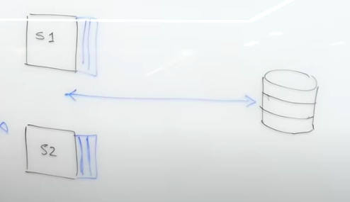

# What is cache?
Cache is storing result of an operation so that future requests return faster.

Cache is a hashtable.

# When to cache?
- Computation is slow (requests to db are slow).
- Computation will run multiple times (commonly used data).
- When the output is the same for a particular input.

# Why cache?
- Reduce network calls
- Avoid recomputations
- Reduce db load

# Coding concept
The cache can be used like a dictionary to query into first.
If something needed is not computed and stored in cache, it is time to touch the db.

    if request in cache:
        return cache[request]
    else:
        read = db_read()
        cache[request] = read
        return read

# What if cache is too large to query?

In case that the cache stores too many information, responses getting from cache is slower than querying from db. 

Cache policy is used to solve this problem.

- Least Recently Used (LRU): The least accessed data stored in the cache will be eliminated to control size of cache. (Not frequently used in real world).

# Cache thrashing

# Where to put cache?
## Near servers
The common way is to use cache as server's memory. 
It is:
- Convenient for small projects and fast deployment.
- Simpler to implement.

Mentioning hazards, if each server has their own cache. The problem will come when there are many servers.
- The caches are not synchronized
-> cannot be consistent of some critical data.

To solve this hazard, we have a global cache in the persistence layer to synchronize the local caches.

## Near db
